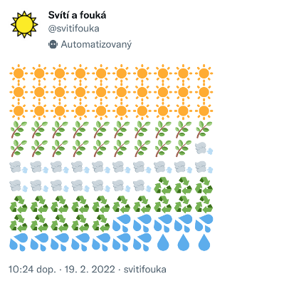

# Svítí a fouká

Twitter bot [@sviti-fouka](https://twitter.com/sviti_fouka) tvítující energetický mix elektřiny vyrobené v Česku z obnovitelných zdrojů za předešlou hodinu z dat [Entsoe](https://transparency.entsoe.eu/). Za každé procento podílu na výrobě jeden emoji.

- 🌿 biomasa
- 🌍 geotermální energie
- ♻️ ostatní obnovitelné zdroje
- ☀️ slunce
- 🌬️ vítr
- 💦 voda (průtok)
- 💧 voda (rezervoár)

Nezahrnuje obnovitelnou složku komunálních odpadů.

## Použití

Běží jako [GitHub Action](https://docs.github.com/en/actions/guides/building-and-testing-python) podle nastavení v `.github/workflows`. Je třeba pro repozitář [nastavit](https://docs.github.com/en/actions/reference/encrypted-secrets#creating-encrypted-secrets-for-a-repository) tokeny pro komunikaci s Entsoe a Twitter API.

Drobný projekt k úvodnímu seznámení se s jazykem Go. Vychází ze starší podoby botu[@sviti-fouka](https://github.com/jandolezal/sviti-fouka) a současné podoby botu [@energy-mix](https://github.com/jandolezal/energy-mix) napsaných s využitím Pythonu a jeho knihoven.
